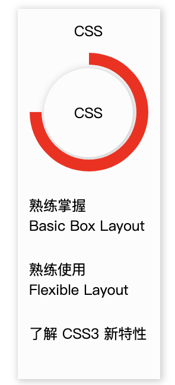

# CSS环形进度条


```html
<div class="card_main">
    <div class="wraper left">
        <div class="ring">div>
    </div>
    <div class="wraper right">
        <div class="ring">div>
    </div>
</div>
```

---

``` less
.wraper {
  width: 50px;
  height: 100%;
  overflow: hidden;
  position: relative;
  .ring {
    position: absolute;
    top: 0;
    height: 100px;
    width: 100px;
    border: 10px solid transparent;
    border-radius: 50%;
  }
}
.right {
  .ring {
    top: 0;
    right: 0;
    border-top: 10px solid red;
    border-right: 10px solid red;
    transform: rotate(-135deg); //-135
      // right增加走到45deg时，left始减少
    animation: cycleRightRing 1slinear forwards;
  }
}
.left {
  .ring {
    border-bottom: 10px solid red;
    border-left: 10px solid red;
    transform: rotate(-135deg); /-135
    animation: cycleLeftRing  1slinear forwards;
    animation-delay: 1s;
  }
}
```