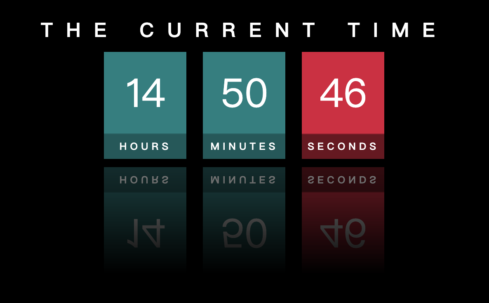

# Digital Clock


```css
div {
    margin: 0 10px;
    display: flex;
    flex-direction: column;
    -webkit-box-reflect: below 10px linear-gradient(transparent,rgba(0,0,0,0.5));
```

```js
   clock()

    function clock() {

        var hours = document.querySelector('#hour');
        var minutes = document.querySelector('#minute');
        var seconds = document.querySelector('#second')

        const date = new Date;
        const h = date.getHours();
        const m = date.getMinutes();
        const s = date.getSeconds();
        // console.log(h, m, s);

        hours.innerHTML = h;
        minutes.innerHTML = m;
        seconds.innerHTML = s
    }

    setInterval(function() {
        clock();
    }, 1000)
```