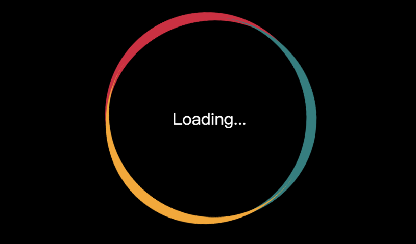

# Loading Effect

## layout
using ::before & ::after
```less
.loading {
        display: flex;
        justify-content: center;
        align-items: center;
        position: relative;
        height: 200px;
        width: 200px;
        border-radius: 50%;
        border-top: crimson solid 10px;
        animation: round 2s linear infinite;
        
        &::before, &::after {
            content: "";
            position: absolute;
            height: 200px;
            width: 200px;
            border-radius: 50%;
            top: -10px;
            left: 0;
        }

        &::before {
            border-top: teal solid 10px;
            transform: rotate(120deg);
        }

        &::after{
            border-top: orange solid 10px;
            transform: rotate(-120deg);
        }
}
```
## double Animation
```less
@keyframes round {
    100% {transform: rotate(360deg);}
}

@keyframes text {
    100% {transform: rotate(-360deg);}
}
```