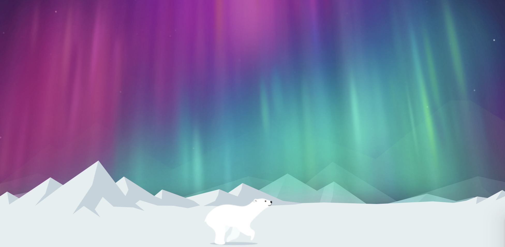

# running bear
CSS3 Animation

### bear

move to the center of screen 
```css
@keyframes bearMove {
     0% {
         left: 0;
     }
     100% {
         left: 50%;
         transform: translateX(-50%);
     }
 }
```
use `steps()` make it running
```css
 @keyframes bearRun {
     0% {
         background-position: 0 0;
     }
     100% {
         background-position: -background-positionX;
     }
 }
```
---

### mountains
```css
@keyframes moving {
    0% {
        background-position: 0;
    }
    100% {
        background-position: -background-positionX;
    }
}
```
---

### aurora light
```css
@keyframes lights {
    0% {
        opacity: 0;
    }
    14% {
        opacity: 1;
    }
    28% {
        opacity: 0;
    }
    100% {
        opacity: 0;
    }
}
```
